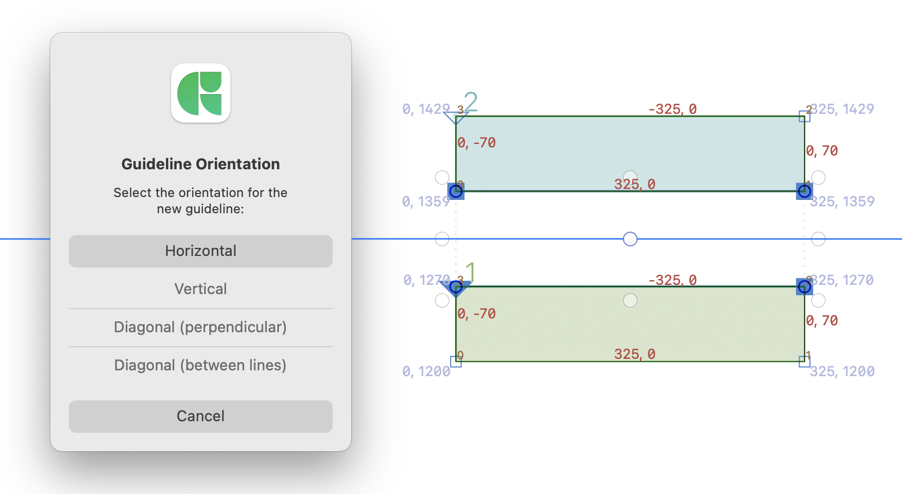

# Enhanced Center Guideline

A **Glyphs 3** plugin to quickly generate centered guidelines between selected objects. Works with node-to-node, node-to-guide, and guide-to-guide selections.

## Installation

1. 💾 **Download the plugin:** Go to the [Latest Release](https://github.com/Accentype-Foundry/glyphs-centerguideline-plugin/releases/latest) page and download the `CenterGuideline.glyphsPlugin.zip` file.
2. 📦 **Unzip the file:** Locate the downloaded `.zip` file and double-click to extract it.
3. 🚀 **Install:** Double-click the `CenterGuideline.glyphsPlugin` file. Glyphs will ask if you want to install it. Confirm and restart Glyphs.

---

## How to find it?

Once installed and Glyphs is restarted, you’ll find the tool here:

**Edit → Enhanced Center Guideline**

---

## Usage

1. Select at least 2 nodes, 2 guides, or one of each.
2. Go to **Edit → Enhanced Center Guideline** or use the shortcut:  
   **`Cmd + Opt + Ctrl + g`**
3. Select the desired orientation from the popup dialog:  
   * **Horizontal / Vertical**  
   * **Diagonal (Perpendicular)** – Useful for slanted stems.  
   * **Diagonal (Between Lines)** – Averages the angle of selected guides.

---

## Features

* **Context-Aware** – Calculates midpoints and angles based on your selection.  
* **Smart Diagonals** – Creates diagonal guidelines and can calculate perpendicular diagonals based on your selection for precise positioning.

---

## Requirements

* **Glyphs 3.2** or later (supports multiple principal classes).  
* **Python** must be installed and active in Glyphs Preferences.

---

## Contributing

Suggestions and bug reports are welcome! If the plugin crashes, check **Window → Macro Panel** for error logs and include them in your issue report.

---

## License

MIT License
